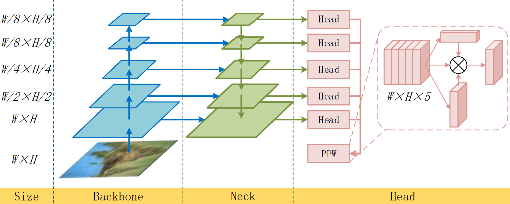

# CTFN and CTFN-KD

## CTFN
```
#train CTFN
python main.py -e 10 --stepsize 6 -l DFL -a PPW --lr 1e-4 --gpu 3 -f StFPN -s 0213-bsds-CTFN -d BSDS -n "train CTFN"
```

## KDED
step 1: prepare the dataset.  
step 2: prepare the Teacher Network(EDTER)(https://github.com/MengyangPu/EDTER) and generate the label.  
step 3: directly run the follwing code.  
```
# train KDED
python main.py -e 20 --stepsize 16 -l SBL -a PPW --lr 1e-4 --gpu 3 -f StFPN -s 1106-bsds-KDED -d BSDS -n "train KDED"
```

## Acknowledgment

```
@article{xie2017hed,
author = {Xie, Saining and Tu, Zhuowen},
journal = {International Journal of Computer Vision},
number = {1},
pages = {3--18},
title = {Holistically-Nested Edge Detection},
volume = {125},
year = {2017}
}

@article{liu2019richer,
author = {Liu, Yun and Cheng, Ming-Ming and Hu, Xiaowei and Bian, Jia-Wang and Zhang, Le and Bai, Xiang and Tang, Jinhui},
journal = {IEEE Trans. Pattern Anal. Mach. Intell.},
number = {8},
pages = {1939--1946},
publisher = {IEEE},
title = {Richer Convolutional Features for Edge Detection},
volume = {41},
year = {2019}
}

@inproceedings{he2019bi-directional,
author = {He, Jianzhong and Zhang, Shiliang and Yang, Ming and Shan, Yanhu and Huang, Tiejun},
booktitle = {IEEE Conference on Computer Vision and Pattern Recognition (CVPR)},
pages = {3828--3837},
title = {Bi-Directional Cascade Network for Perceptual Edge Detection},
year = {2019}
}

@article{huan2022unmixing,
  title={Unmixing Convolutional Features for Crisp Edge Detection},
  author={Huan, Linxi and Xue, Nan and Zheng, Xianwei and He, Wei and Gong, Jianya and Xia, Gui-Song},
  journal={IEEE Transactions on Pattern Analysis and Machine Intelligence},
  volume={44},
  number={10\_Part\_1},
  pages={6602--6609},
  year={2022},
  publisher={IEEE}
}

@inproceedings{pu2022edter,
  title={EDTER: Edge Detection with Transformer},
  author={Pu, Mengyang and Huang, Yaping and Liu, Yuming and Guan, Qingji and Ling, Haibin},
  booktitle={Proceedings of the IEEE/CVF Conference on Computer Vision and Pattern Recognition},
  pages={1402--1412},
  year={2022}
}
```
